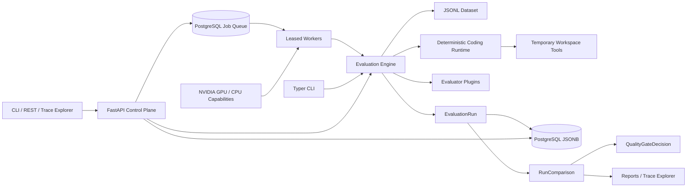

# AgentEval Control Plane

`aecontrol` is a control plane for evaluating deterministic tool-using coding agents. It compares
agent versions, records normalized trajectories, detects aggregate and slice-level regressions,
enforces YAML release gates, and persists evaluation evidence in PostgreSQL behind a FastAPI service.

Aggregate scores are not enough for agents: a candidate can look mostly unchanged overall while
getting worse on a critical slice such as security validation. This project makes that failure mode
visible and blocks the release.

## Demo

```bash
uv sync --extra dev
make demo
```

The demo evaluates:

- `baseline`
- `candidate_regressed`
- `candidate_fixed`

It writes JSON and standalone HTML reports under `reports/`. The regressed candidate is blocked
because it drops hidden-test success on the `security_sensitive` slice. The fixed candidate passes.


Expected demo summary:

```text
baseline: hidden pass rate 24/24
candidate_regressed: hidden pass rate 22/24
delta=-8.33% regressed=['SEC-01', 'SEC-04']
gate: BLOCK
candidate_fixed: hidden pass rate 24/24
delta=0.00% regressed=[]
gate: PASS
```

## Useful Commands

```bash
uv run aecontrol doctor
uv run aecontrol agents versions
uv run aecontrol datasets validate examples/datasets/coding_repair.jsonl
uv run aecontrol run --suite examples/suites/coding_repair.yaml --agent-version baseline --output reports/baseline.json
uv run aecontrol compare --baseline reports/baseline.json --candidate reports/regressed.json --output reports/regressed-comparison.json
uv run aecontrol gate --comparison reports/regressed-comparison.json --policy examples/policies/coding_repair_gate.yaml
uv run aecontrol report --comparison reports/regressed-comparison.json --policy examples/policies/coding_repair_gate.yaml --baseline-run reports/baseline.json --candidate-run reports/regressed.json --output reports/regressed.html
```

## Control Plane Service

For local development, the repository can create an unprivileged project PostgreSQL cluster on port
`55432`, so it does not require sudo or alter a system cluster. `PG_BIN` can override the server
binary directory when `pg_config` is not on `PATH`.

```bash
make service-demo
make serve
```

Open `http://127.0.0.1:8000` for the run and trace explorer or
`http://127.0.0.1:8000/docs` for the interactive OpenAPI contract. The service can execute and
persist evaluations, retrieve individual case trajectories, compare stored run IDs, apply release
policies, and inspect durable gate decisions. Its preferred execution path queues jobs for independent
workers using expiring PostgreSQL leases and bounded retries.

```bash
uv run aecontrol jobs enqueue --suite examples/suites/coding_repair.yaml --agent-version candidate_fixed --priority 10
uv run aecontrol worker --once
uv run aecontrol jobs list
uv run aecontrol hardware
```

The claim protocol uses `FOR UPDATE SKIP LOCKED`, supports crash recovery through lease expiration,
and prevents stale workers from acknowledging work they no longer own. See
[`docs/distributed-execution.md`](docs/distributed-execution.md) for the state machine and delivery
semantics.

Workers also refresh NVIDIA GPU telemetry through `nvidia-smi` on lease heartbeats. Jobs can request
`cpu` or `cuda` and exact-match pool labels; Prometheus exposes per-device memory, utilization,
temperature, and power gauges. Incompatible workers skip jobs without consuming an attempt. See
[`docs/hardware-scheduling.md`](docs/hardware-scheduling.md) for the normalized capability contract.

CUDA jobs may require minimum framebuffer capacity and compute capability. PostgreSQL admits a lease
only when one GPU satisfies the complete request, preventing accidental cross-device aggregation.

Use `make serve PORT=8001` when port `8000` is already occupied.


Set `DATABASE_URL` to use an existing PostgreSQL deployment. The default is shown in `.env.example`.

Operational endpoints provide database health, queue-aware readiness, Prometheus-compatible metrics,
and correlated request timing:

```bash
curl http://127.0.0.1:8000/healthz
curl http://127.0.0.1:8000/readyz
curl http://127.0.0.1:8000/metrics
```

See [`docs/operations.md`](docs/operations.md) for metric semantics and request-ID behavior.

## Python SDK

The package exports typed synchronous and asynchronous clients for evaluations, durable jobs, runs,
comparisons, cancellation, waiting, health, and operations.

```python
from aecontrol import AgentEvalClient

client = AgentEvalClient("http://127.0.0.1:8000")
job = client.enqueue_job("examples/suites/coding_repair.yaml", "candidate_fixed")
completed = client.wait_for_job(job.job_id)
```

Run `make sdk-demo` for a self-contained live example. See [`docs/sdk.md`](docs/sdk.md) for sync and
async usage.

## Architecture



## Docker

```bash
make docker-build
make docker-demo
```

The local Makefile uses native Podman by default because Snap-installed VS Code can break Docker
emulation through a revision-specific `XDG_DATA_HOME`. Set `CONTAINER_ENGINE=docker` if you want to
force Docker on a host with a healthy Docker daemon.

## Execution Isolation

The default process sandbox enforces source-size, syntax, import/call, wall-clock, CPU, address-space,
file-size, descriptor, process-count, output, and environment limits. A rootless Podman backend adds a
read-only workspace, disabled networking, dropped Linux capabilities, `no-new-privileges`, an
unprivileged UID, and container CPU/memory/PID limits.

```bash
make sandbox-demo
AECONTROL_SANDBOX_BACKEND=podman uv run aecontrol doctor
```

Every run records `sandbox_backend` provenance. See [`docs/security.md`](docs/security.md) for the
threat model and remaining boundary assumptions.

## Ollama Runtime

Ollama is an optional model-backed runtime; deterministic agents remain the required CI path. The
smoke suite evaluates one case from each slice with structured generation, fixed seed and temperature,
prompt hashing, full trajectory capture, and the same public/hidden tests used by deterministic runs.

```bash
uv run aecontrol ollama doctor
uv run aecontrol ollama models
make ollama-demo
```

Agent versions use `ollama/<model>`, such as `ollama/llama3.2:3b`. Queued Ollama jobs automatically
require the `runtime=ollama` worker label. Start a compatible worker with
`uv run aecontrol worker --label runtime=ollama`.

The checked local smoke run passed 1/4 hidden tests and was correctly blocked, revealing distinct
typing, async, and security failure modes. See
[`docs/ollama-evaluation.md`](docs/ollama-evaluation.md) for the evidence summary.


## OpenAI-Compatible Runtime

Agent versions such as `openai/llama3.2:3b` use a provider-neutral chat-completions adapter with
structured output, fixed generation settings, usage metadata, prompt hashing, and isolated failures.
The default endpoint is Ollama's local `/v1`; environment configuration can target compatible hosted
services or NVIDIA NIM deployments.

```bash
uv run aecontrol openai doctor
uv run aecontrol openai models
make openai-demo
```

See [`docs/openai-compatible.md`](docs/openai-compatible.md) for endpoint configuration and the limits
of the checked compatibility claim.

## Scoped API Authentication

Production-style bearer authentication can be enabled without changing the zero-configuration local
demo. API keys are stored as SHA-256 digests, compared in constant time, assigned `read`, `write`, or
`admin` scopes, represented in OpenAPI, and attributed by key ID in structured request logs.

```bash
uv run aecontrol auth hash-key
uv run aecontrol auth validate auth.yaml
AECONTROL_AUTH_CONFIG=auth.yaml make serve
```

See [`docs/authentication.md`](docs/authentication.md) for configuration and rotation guidance.

## Current Limitations

The browser explorer is intentionally local-trust for this portfolio phase. Temporary workspaces are not
hardened isolation for untrusted code. Kubernetes execution, hosted LLM runtimes, object storage,
NeMo/LangGraph adapters, and production observability remain in `docs/roadmap.md`.
