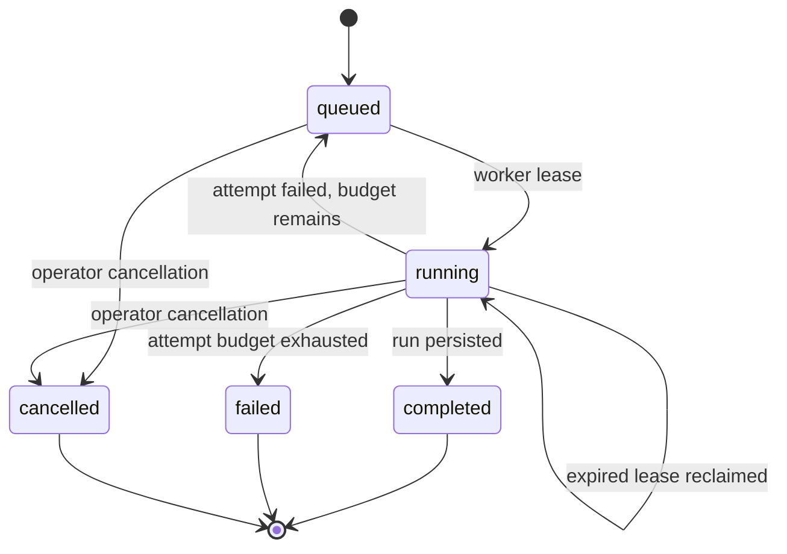

# Distributed Evaluation Jobs

The control plane separates job admission from execution. API and CLI clients enqueue immutable
suite and agent-version requests in PostgreSQL, while independently scalable workers claim work.



## Claim Protocol

Workers claim one row in a transaction using `FOR UPDATE SKIP LOCKED`, ordered by priority and enqueue
time. This permits multiple workers to poll concurrently without duplicate claims or a central
coordinator. A claim records the worker identity, increments the attempt count, and establishes an
expiring lease.

The worker renews its lease while the evaluation runs. If a process disappears, another worker can
reclaim the row after expiration. A worker may complete or fail a job only while it owns the active
lease. Cancellation clears the lease and prevents a late worker acknowledgement from changing the
terminal state.

## Delivery Semantics

Execution is at least once because a worker can finish external work and disappear before committing
completion. Run writes are idempotent by `run_id`, and the worker persists the run before atomically
linking it to the completed job. Production adapters with side effects must supply their own
idempotency key based on `job_id`.

Retries are bounded per job. Failure details are truncated before storage, successful retries clear
old errors, and exhausted jobs remain queryable for diagnosis. The integration suite starts eight
worker threads against one row and asserts that exactly one receives the lease.

## Placement Diagnostics

`GET /api/v1/jobs/{job_id}/placement` evaluates the job against registered workers without claiming
it. The response distinguishes stale heartbeats, missing accelerators, exact-label mismatches, GPU
memory limits, compute capability, and cross-device resource splits. It includes active and matching
worker counts plus each worker's complete blocker list.

```bash
uv run aecontrol jobs explain JOB_ID
uv run aecontrol jobs explain JOB_ID --json
```

Diagnostics are observational and may change with the next worker heartbeat. The authoritative lease
decision remains the atomic PostgreSQL claim transaction.
